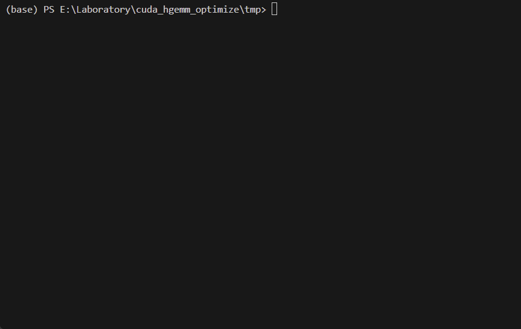
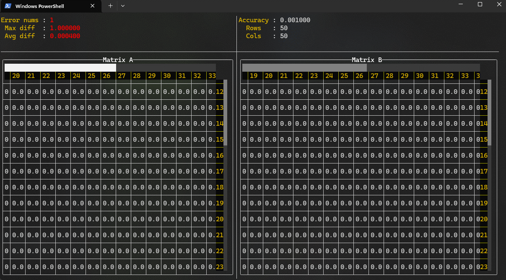

## Build

We need install the cross-platform build utility [xmake](https://xmake.io/#/guide/installation) first.

### build TUI

depend on CUDA tool kit
~~~shell
xmake build TUI
~~~~

### build tui_tool_sets
Pure C++ static library project, provide many useful functions to help gemm algorithm develop. detail in [tui_tool_sets_runable.hpp](./tui/include/tui_tool_sets_runable.hpp) here is some effect

~~~shell
xmake build tui_tool_sets
~~~

Can be installed independently using
~~~shell
xmake install -o /path/to/install tui_tool_sets
~~~
details can reference demo [tmp](./tmp)

## Run TUI
~~~shell
xmake run TUI
~~~
